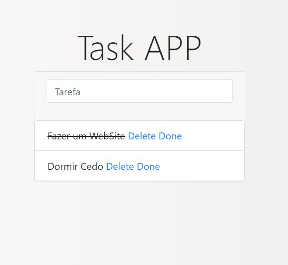

Projeto de um site todolist simples desenvolvido em python com uso do Flask e SQLite.

## Screenshot



## como executar o projeto

Para iniciar o projeto, inicialente você deve instalar os recursos necessários
através do `pip` com o comando:

```bash
  pip3 install -r requirements.txt
```

Após isso, será necessário criar o banco de dados usando o [Manager e Migrate](https://flask-migrate.readthedocs.io/en/latest/ "Referências") através dos comandos:

```bash
  $ python run.py db init
  $ python run.py db migrate
  $ python run.py db upgrade
```


Por fim, podemos utilizar a aplicação com o comando:

```bash
  $ python run.py runserver
```
